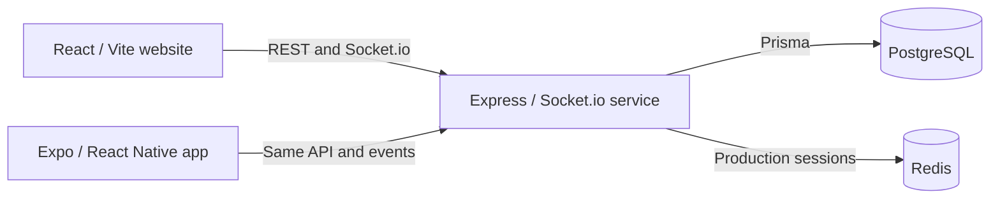

# ROOM-5

ROOM-5 is a small-group chat application with a React website, an Expo mobile app, and a shared Express + Socket.io backend. Choose a guest name and avatar, create a room, and share its link or code to start a conversation without registering an account.

Rooms are designed for up to five active guests. PostgreSQL stores guest profiles, rooms, memberships, and messages; Socket.io delivers messages and presence updates in real time.

**Current status:** the local application is implemented. Production hosting preparation exists, but public hosting, frontend production routing, and end-to-end production verification are still outstanding. This repository does not establish a live production deployment.

## Contents

- [Key features](#key-features)
- [How ROOM-5 works](#how-room-5-works)
- [Tech stack](#tech-stack)
- [Project structure](#project-structure)
- [Local development](#local-development)
- [Environment variables](#environment-variables)
- [Database](#database)
- [Real-time architecture](#real-time-architecture)
- [API](#api)
- [Deployment](#deployment)
- [Security](#security)
- [Current project status](#current-project-status)
- [Roadmap](#roadmap)
- [Contributing](#contributing)
- [License](#license)
- [Repository](#repository)

## Key features

- **Guest profiles:** enter a display name and choose an emoji avatar or use name initials; edit the profile later.
- **Room creation and joining:** create a room with a six-character code and invite others through `/room/<code>`.
- **Small-group conversations:** both REST and Socket.io joining check the five-member capacity.
- **Real-time text and emoji messages:** the website supports multiline input, optimistic sending, sender details, and timestamps.
- **Stored messages:** messages are saved in PostgreSQL and can be retrieved by active room members.
- **Live membership updates:** join/leave events update the members sidebar or mobile member sheet.
- **Session restoration and reconnection:** clients restore a valid guest session and attempt to rejoin after a connection interruption.
- **Mobile client:** Expo screens support onboarding, rooms, messaging, older-history loading, send retry, and native invite sharing.

### What “private room” means

Rooms are unlisted and shared by code or link. Anyone who knows a valid code can create a guest profile and join if capacity permits. There is no separate public/private setting, room password, owner approval, or invitation allowlist. Messages are not end-to-end encrypted.

## How ROOM-5 works

1. A visitor chooses a name and avatar. The backend creates or updates a guest associated with the browser/app session.
2. The guest creates a room or opens a shared room link. The backend checks membership and available capacity when joining.
3. The client connects to Socket.io using the same session as its REST requests and subscribes to the room.
4. The server sends the room state, stores new messages through Prisma, and broadcasts messages and presence events.
5. Leaving updates membership through REST and exits the Socket.io channel. When a guest's last connected socket disconnects, the server marks their active memberships as left.



The web client uses React Router for navigation and Zustand for guest/room state. Browser storage remembers name/avatar preferences; the backend cookie session determines identity. Restoring a preference after session loss can create a new guest—it is not account recovery or cross-device identity.

## Tech stack

| Area | Technologies present in the repository |
| --- | --- |
| Monorepo | npm workspaces, committed `package-lock.json`, TypeScript |
| Website | React 18, Vite 5, React Router 6, Zustand |
| Website presentation | Tailwind CSS, PostCSS, Framer Motion, Lucide icons, Floating UI |
| Backend | Node.js, Express 4, Socket.io 4 |
| Database | PostgreSQL, Prisma 5 |
| Sessions | `express-session`, `connect-redis`, Redis client |
| Validation and HTTP middleware | Zod, Helmet, CORS, cookie-parser, Morgan |
| Mobile | Expo, React Native, React 19, Expo Router, SecureStore, native cookie manager |
| Local infrastructure | Docker Compose for PostgreSQL, supplied through a private local file |

Dependency versions are defined by the workspace manifests and lockfile. No deployment platform is configured by the presence of these dependencies.

## Project structure

```text
ROOM-5/
├── apps/
│   ├── client/
│   │   ├── src/
│   │   │   ├── components/       # Guest forms, messages, profiles, members
│   │   │   ├── pages/            # Lobby, join flow, chat room
│   │   │   ├── services/         # REST and Socket.io clients
│   │   │   ├── stores/           # Zustand guest and room state
│   │   │   └── hooks/            # Guest and room hooks
│   │   ├── index.html
│   │   └── vite.config.ts       # Website dev server and /api proxy
│   ├── server/
│   │   ├── src/
│   │   │   ├── config/           # Environment, Prisma, sessions
│   │   │   ├── middleware/       # Guest auth, validation, errors
│   │   │   ├── modules/          # Guest and room REST endpoints
│   │   │   ├── socket/           # Session auth and chat/presence events
│   │   │   ├── app.ts            # Express app and /health
│   │   │   └── server.ts         # HTTP/Socket.io startup and shutdown
│   │   ├── prisma/
│   │   │   ├── schema.prisma
│   │   │   └── migrations/       # Committed PostgreSQL migrations
│   │   ├── .env.production.example
│   │   └── DEPLOYMENT.md
│   └── mobile/
│       ├── app/                 # Expo Router screens
│       ├── src/                 # API, sessions, room channel, links, UI
│       ├── scripts/             # Local Android release/signing helpers
│       ├── assets/
│       ├── app.config.ts
│       ├── eas.json             # Generic, unverified EAS profiles
│       └── RELEASE.md
├── packages/shared/src/         # Zod schemas, types, limits and constants
├── package.json                 # Workspace configuration and root scripts
├── package-lock.json
├── tsconfig.base.json
├── .gitignore
└── README.md
```

Real `.env` files, `docker-compose.yml`, generated native folders, dependencies, and build output are ignored. The local server `.env.example` is also ignored and is not available in a fresh clone. Root `cdp-*.mjs` and `cap-check.mjs` files are manual local diagnostics, not an automated test suite.

## Local development

### Prerequisites

- Node.js **24.19.0** matches the verified local runtime. The manifest's broader `>=20` range alone does not guarantee compatibility with the server's CommonJS-to-ESM shared-package import.
- npm **10.8.2**, as declared in `package.json`.
- PostgreSQL; the existing local Compose setup uses PostgreSQL 16.
- Docker with Compose if using the container example below.
- Redis is optional in development and required in production.

If you already have working private environment and Compose files, keep their values. The following setup also works as a guide for a fresh clone.

### 1. Clone and install the web/backend workspaces

```sh
git clone https://github.com/ThechillBoy/ROOM-5.git
cd ROOM-5
npx --yes npm@10.8.2 ci --workspace=@room5/shared --workspace=@room5/client --workspace=@room5/server --include-workspace-root --include=dev
```

Use the committed lockfile. These targeted workspaces are sufficient for website development; mobile setup is separate.

### 2. Start a local PostgreSQL database

You may use an existing local PostgreSQL installation. Alternatively, create a **private, ignored** root `docker-compose.yml`:

```yaml
services:
  postgres:
    image: postgres:16-alpine
    environment:
      POSTGRES_DB: ${POSTGRES_DB:?Set POSTGRES_DB}
      POSTGRES_USER: ${POSTGRES_USER:?Set POSTGRES_USER}
      POSTGRES_PASSWORD: ${POSTGRES_PASSWORD:?Set POSTGRES_PASSWORD}
    ports:
      - "127.0.0.1:5432:5432"
    volumes:
      - room5_postgres_data:/var/lib/postgresql/data

volumes:
  room5_postgres_data:
```

Create a private root `.env` for Compose, replacing every placeholder:

```dotenv
POSTGRES_DB=<your-local-database-name>
POSTGRES_USER=<your-local-database-user>
POSTGRES_PASSWORD=<your-generated-local-password>
```

These three variables belong to the container setup, not the application server. Then run:

```sh
npm run db:up
```

`db:up` does not create a Compose file or start Redis. If port 5432 is already occupied, use the existing database or choose another host port and adjust `DATABASE_URL` accordingly. Keep the same database credentials when reusing an initialized volume.

### 3. Configure the backend

Create `apps/server/.env` with local values:

```dotenv
NODE_ENV=development
PORT=3000
CLIENT_URL=http://localhost:5173
DATABASE_URL="postgresql://<user>:<url-encoded-password>@localhost:5432/<database>?schema=public"
SESSION_SECRET=
```

Replace the connection placeholders and fill `SESSION_SECRET` with a privately generated value. For example, run this locally and copy its output into your private file:

```sh
node -e "console.log(require('node:crypto').randomBytes(32).toString('hex'))"
```

Do not commit that output. Without `REDIS_URL`, development uses an in-memory session store that is lost on server restart. To use Redis locally, supply a reachable `redis://` or `rediss://` connection in the server environment.

### 4. Configure the website

Create `apps/client/.env.local`:

```dotenv
VITE_SOCKET_URL=http://localhost:3000
```

REST requests use `/api`; Vite proxies them to `http://localhost:3000`. Use `http://localhost:5173` consistently so the browser origin matches `CLIENT_URL`. If you change ports, also review the Vite proxy and Socket.io URL.

### 5. Generate, migrate, and run

From the repository root, with the local database running:

```sh
npm run prisma:generate --workspace=@room5/server
npm run build --workspace=@room5/shared
npm run db:migrate
npm run dev
```

`db:migrate` runs `prisma migrate dev`; use it only against your development database. An existing local PostgreSQL installation must allow the development role to create Prisma's temporary shadow database. [Prisma shadow database documentation](https://www.prisma.io/docs/orm/prisma-migrate/understanding-prisma-migrate/shadow-database)

`npm run dev` starts the Express server and Vite website, but does not start PostgreSQL/Redis or build/watch the shared package.

- Website: `http://localhost:5173`
- Backend liveness: `http://localhost:3000/health`
- Separate servers: `npm run dev:server` and `npm run dev:client`
- If editing shared schemas/types, run `npm run dev --workspace=@room5/shared` in another terminal.
- Stop Compose services with `npm run db:down`; the example's named database volume is retained.

### Build and type-check

Build only the components you need, with shared output first:

```sh
npm run build --workspace=@room5/shared
npm run build --workspace=@room5/client
npm run prisma:generate --workspace=@room5/server
npm run build --workspace=@room5/server
```

Outputs are `packages/shared/dist`, `apps/client/dist`, and `apps/server/dist`. A compiled backend starts with `npm run start --workspace=@room5/server` and still needs its environment and database.

```sh
npm run typecheck --workspace=@room5/shared
npm run typecheck --workspace=@room5/client
npm run typecheck --workspace=@room5/server
```

Avoid the root `npm run build` for a website-only build. It builds all workspaces and invokes mobile's `prebuild` lifecycle, which runs `expo prebuild --clean` and regenerates native files. The mobile workspace `build` has the same lifecycle concern. Vite preview is a local preview server; its inherited `/api` proxy still targets the local backend and does not establish production hosting.

### Optional mobile development

For mobile work, install the full workspace dependencies with `npx --yes npm@10.8.2 ci --include=dev`. Copy `apps/mobile/.env.example` to the private `apps/mobile/.env`, then configure the backend origin.

```sh
npm run start --workspace=@room5/mobile
npm run android --workspace=@room5/mobile
```

The first command starts Metro; the second invokes Expo's Android build/run tooling and requires an Android SDK, JDK, and emulator/device. Android emulator development defaults to `http://10.0.2.2:3000`; a physical device needs a reachable host address. The app uses a native cookie manager, so do not assume it runs in Expo Go.

Generated `/android` and `/ios` folders are ignored. The preserved local Gradle release integration is not included in a clean clone; the Android release helpers are not a complete fresh-clone release setup. See [Android release notes](apps/mobile/RELEASE.md) before changing native files or attempting a release.

## Environment variables

### Website: public build settings

| Variable | Purpose | Requirement |
| --- | --- | --- |
| `VITE_SOCKET_URL` | Socket.io backend origin, without `/api` | Defaults to `http://localhost:3000`; set an explicit HTTPS origin for a public build |

This is the only custom `VITE_*` variable currently consumed by the website. **`VITE_API_URL` is not implemented:** REST remains fixed at `/api` in `apps/client/src/services/api.ts`.

Vite replaces public variables during the build, so rebuild when their values change. Never place secrets in `VITE_*` variables. [Vite environment documentation](https://v5.vite.dev/guide/env-and-mode)

### Backend: configuration and secrets

| Variable | Purpose | Required/default | Visibility |
| --- | --- | --- | --- |
| `NODE_ENV` | Development/production/test mode; controls cookies and production Redis requirement | Default `development`; use `production` when hosted | Configuration |
| `PORT` | Positive integer HTTP listening port | Default `3000`; use provider-assigned port | Configuration |
| `DATABASE_URL` | PostgreSQL connection used by Prisma | Required; include provider-required TLS settings in production | Secret |
| `REDIS_URL` | Redis session store connection; accepts `redis://` or `rediss://` | Required in production; optional in development | Secret |
| `SESSION_SECRET` | Signs the session cookie | Required, at least 32 characters; generate with at least 32 random bytes and retain across deploys | Secret |
| `CLIENT_URL` | Exact website origin allowed by REST and Socket.io CORS | Required; local `http://localhost:5173`, production HTTPS origin | Configuration |

Workspace commands run the server inside `apps/server`, where `dotenv/config` loads `.env`. The safe [.env.production.example](apps/server/.env.production.example) documents settings; the server does not automatically load that example or select a `.env.production` file. Hosted secrets should be injected by the provider.

### Mobile: public settings and release tooling

| Variable | Purpose |
| --- | --- |
| `EXPO_PUBLIC_API_URL` | REST and Socket.io backend origin; releases require a real public HTTPS origin |
| `EXPO_PUBLIC_WEB_URL` | Optional website origin included as an invite fallback |
| `EXPO_PUBLIC_APP_ENV` | Development/production profile; required as `production` by release validation |
| `ROOM5_ANDROID_VERSION_CODE` | Positive Android release version code; defaults to `1`, increase for subsequent uploads |
| `EAS_BUILD_PROFILE` | Expo configuration also triggers production validation when this is `production` |

`EXPO_PUBLIC_*` values are public app configuration. Private local/CI signing settings are `ROOM5_UPLOAD_STORE_FILE`, `ROOM5_UPLOAD_STORE_PASSWORD`, `ROOM5_UPLOAD_KEY_ALIAS`, and `ROOM5_UPLOAD_KEY_PASSWORD`; never commit their values or keystores. `JAVA_HOME` locates JDK tools. The release wrapper manages its own dotenv/build-mode flags; see [RELEASE.md](apps/mobile/RELEASE.md) for that workflow.

## Database

Prisma's [schema](apps/server/prisma/schema.prisma) uses PostgreSQL and defines:

| Model | Stored data |
| --- | --- |
| `Guest` | Name, avatar, unique session ID, timestamps |
| `Room` | Unique six-character code and timestamps |
| `RoomMember` | Guest/room relationship, join time, optional leave time; unique guest-room pair |
| `Message` | Room, sender, text content, creation time; room/time index |

The committed initial migration is under [apps/server/prisma/migrations](apps/server/prisma/migrations). Leaving a room sets `leftAt`; it does not delete the room or its messages. No automatic room/message expiration or application deletion endpoint is implemented.

Run these commands from the repository root:

```sh
# Generate the Prisma client after installing or changing the schema
npm run prisma:generate --workspace=@room5/server

# Development migration workflow
npm run db:migrate

# Inspect the configured local database
npm run db:studio

# Production release: apply committed migrations to the intended database
npm run prisma:deploy --workspace=@room5/server
```

Production migrations must receive the correct production `DATABASE_URL`. Use `migrate deploy`, not `migrate dev` or `db push`, for production releases. Keep the Prisma CLI installed until migrations finish. Migrations create/update schema; copying local records to production is a separate decision and process.

## Real-time architecture

Socket.io is attached to the same HTTP server as Express, using the default `/socket.io/` path and polling/WebSocket transports. The browser sets `withCredentials: true`; socket authentication reuses the Express session and looks up the associated guest in PostgreSQL. Internal broadcast channels are named `room:<code>`.

| Direction | Event | Payload/purpose |
| --- | --- | --- |
| Client → server | `room:join` | `{ code }`; join/reactivate membership and subscribe to the channel |
| Client → server | `message:send` | `{ code, content, tempId }`; validate membership, store and broadcast text |
| Client → server | `room:leave` | `{ code }`; exit the channel and notify others; clients also call REST leave to update membership |
| Server → joining client | `room:state` | `{ room, messages, members, me }`; initial room snapshot |
| Server → room | `message:new` | Persisted message, sender summary, and `tempId` for optimistic-message reconciliation |
| Server → other members | `presence:join` | `{ guestId, name, avatar }` |
| Server → other members | `presence:leave` | `{ guestId }` |
| Server → client | `room:error` | `{ message }` |
| Server → client | `message:error` | `{ tempId, message }` |

There is no REST message-send endpoint or Socket.io acknowledgment protocol. A reconnect attempts `room:join` again. The server tracks connected sockets per guest and performs membership cleanup after the last socket disconnects.

The current socket snapshot selects the first 50 stored messages in chronological order. REST history selects recent messages and offers cursor parameters; these paths are not equivalent. The website has no load-older control. The mobile client implements history loading and retry controls, but history selection/pagination still needs consistency work.

## API

The Express server mounts the following routes. Protected requests need the `room5.sid` cookie associated with an existing guest. “Active member” additionally means a `RoomMember` record whose `leftAt` is `null`.

| Method | Path | Purpose/input | Session/access | Success |
| --- | --- | --- | --- | --- |
| `GET` | `/health` | Application liveness | No guest required | `200`, `{ status: "ok", timestamp }` |
| `POST` | `/api/guest` | Create or update the current session's guest; `{ name, avatar }` | No existing guest required | `201`, guest record |
| `GET` | `/api/guest` | Retrieve current guest | Existing guest | `200`, guest record |
| `PATCH` | `/api/guest` | Edit `name` and/or `avatar`; at least one field | Existing guest | `200`, updated guest |
| `POST` | `/api/rooms` | Create a room; `{}` | Existing guest | `201`, `{ id, code }` |
| `GET` | `/api/rooms/:code` | Retrieve room and active members | Active member | `200`, room record with members |
| `POST` | `/api/rooms/:code/join` | Join/rejoin; `{ code }`, matching the path | Existing guest; capacity check | `200`, `{ room, members }` |
| `POST` | `/api/rooms/:code/leave` | Mark membership as left | Existing guest | `204`, no body |
| `GET` | `/api/rooms/:code/members` | Retrieve active members with guest summaries | Active member | `200`, member array |
| `GET` | `/api/rooms/:code/messages` | History; `limit` 1–100 (default 50), optional message-ID `cursor` | Active member | `200`, `{ messages, hasMore }` |

Creating a room does not automatically join it on the backend. Clients perform a separate join. Use the same code in the join path and body: the current service takes the body code.

REST responses use JSON, except the empty leave response. Dates serialize as ISO strings. Guest responses currently include a `sessionId` field; do not log or publish guest/session payloads. Most handled errors use `{ "error": "..." }`: missing guest `401`, nonmember access `403`, missing room `404`, and a full room on REST join `409`. Invalid history query handling is not consistently normalized and needs review.

Shared limits are names up to 32 characters, avatars up to 8, six uppercase alphanumeric code characters, and messages up to 4,000 characters. The current code generator produces uppercase hexadecimal codes.

## Deployment

Deployment preparation is documented in [backend hosting instructions](apps/server/DEPLOYMENT.md) and [Android release notes](apps/mobile/RELEASE.md). These documents do not provision infrastructure or establish a verified production deployment. No Cloudflare Pages, Netlify, Vercel, or other production hosting configuration is committed.

### Frontend

- Build from the repository root: shared first, then `npm run build --workspace=@room5/client`.
- Publish `apps/client/dist` with SPA fallback for `/lobby`, `/room/new`, and `/room/:code`.
- Set `VITE_SOCKET_URL` to the intended public HTTPS backend origin at build time.
- Resolve REST routing before publication: `/api` currently relies on Vite's development proxy. Production needs a real same-origin backend proxy, or a future code change to support a separate API base URL. Merely setting `VITE_API_URL` does nothing today.
- If using a same-origin proxy for REST, route Socket.io through the same public cookie host too. Mixing proxied REST with direct Socket.io on another host loses the current host-scoped session cookie. A static host alone does not run the backend. Cloudflare Pages is a possible frontend target, not an existing deployment; its `_redirects` file cannot proxy to an external API. [Cloudflare redirect documentation](https://developers.cloudflare.com/pages/configuration/redirects/)

### Backend

- Use one persistent Node.js process/replica initially, with PostgreSQL and Redis reachable from it.
- Install/build from the repository root because the lockfile and shared package live there.
- Generate Prisma, build shared, then build server; retain both workspace outputs, runtime dependencies, and generated Prisma client.
- Apply committed migrations during the release step, then start with `npm run start --workspace=@room5/server`.
- Provide HTTPS termination, credentialed requests, polling, and WebSocket upgrades. Forward `/api/*`, `/socket.io/*`, and `/health` without rewriting their paths.
- Match the actual trusted proxy topology to Express's current `trust proxy = 1` setting and forward trustworthy HTTPS headers.
- Set proxy idle timeout above Socket.io's heartbeat window; at least 60 seconds suits the current defaults. [Socket.io reverse proxy guidance](https://socket.io/docs/v4/reverse-proxy/)

### PostgreSQL and Redis

PostgreSQL needs durable storage, provider-required TLS, backups, and migration access. A connection pooler may require a direct connection for migrations. The application currently reads `DATABASE_URL`; no separate `DIRECT_URL` setting is consumed.

Redis needs a standard Redis TCP/TLS connection, persistence/backups, and a session-preserving eviction policy. Redis here stores sessions only; it is not a distributed Socket.io adapter. Multiple backend replicas require additional coordination beyond the current implementation.

### Cookies and production verification

Set `CLIENT_URL` to the exact HTTPS website origin, without a trailing slash. Keep a stable session secret. Prefer frontend and API hosts under the same registrable domain, or a same-origin proxy: unrelated sites can encounter third-party-cookie blocking despite correct CORS and cookie flags. [Browser CORS/cookie behavior](https://developer.mozilla.org/en-US/docs/Web/HTTP/Guides/CORS)

Before claiming readiness, verify public guest restoration, room flows, history, presence, real WebSocket upgrades, and session survival after backend/Redis restarts. `GET /health` is liveness only; its `200` does not prove database connectivity or continuing Redis availability.

## Security

Implemented controls include:

- `HttpOnly` session cookie named `room5.sid`, host-scoped with a rolling 24-hour lifetime.
- Production `Secure` and `SameSite=None` cookies; development uses non-secure `SameSite=Lax` cookies.
- Redis required before the production listener starts; development may use MemoryStore.
- Credentialed CORS restricted to one configured `CLIENT_URL` for REST and Socket.io.
- Guest/session lookup and active-membership checks for protected room data and message sending.
- Zod validation for REST inputs/environment and manual checks in Socket.io handlers.
- Helmet HTTP headers and a central error handler that returns generic unexpected errors outside development. The room-join handler currently returns its caught error message instead.
- Git ignore rules for real env files, private credentials, signing material, dependencies, and generated output.

Never commit database/Redis URLs with credentials, session/API secrets, private certificates, `.env` files, Android keystores, or signing properties. Keep secrets in private local files or provider secret settings. Public `VITE_*` and `EXPO_PUBLIC_*` settings must contain no secrets.

There is no implemented rate limiter, explicit CSRF protection, verified user identity, room moderation, or end-to-end encryption. CORS and room codes do not replace those controls. The five-member admission check is not transactional, so simultaneous joins need further hardening before promising strict concurrency guarantees.

## Current project status

| Area | Current state |
| --- | --- |
| Website | Guest profiles, rooms, text/emoji chat, member UI, profile editing, sharing, and reconnection implemented |
| Backend/database | REST endpoints, Socket.io events, PostgreSQL persistence, committed migration, and production session configuration implemented |
| Web history | Initial socket snapshot is limited to the first 50 messages; no load-older/search UI |
| Recent rooms | Lobby placeholder only; no functional recent-room list |
| Presence | Join/leave membership updates; no implemented idle/offline status engine |
| Mobile | Chat client implemented; Android release preparation exists, but preserved native release integration is local and EAS production setup is unverified |
| Production | Frontend routing, hosting/services/domains, and live HTTPS/cookie/WebSocket verification remain outstanding |
| Quality tooling | Typecheck scripts exist; no automated test runner/script or GitHub Actions workflow is committed. Only mobile has a tracked ESLint configuration |

No attachment uploads, calls, typing indicators, read receipts, message editing/deletion, account recovery, public room discovery, or automatic room/message expiry is implemented.

Manual root diagnostic scripts assume local services and, in several cases, a specific Windows browser path. Some create guests, rooms, and messages. Do not treat them as portable, read-only regression tests.

## Roadmap

The following are proposed future improvements, **not implemented features or scheduled releases**:

- Complete production frontend routing and verify the hosted stack.
- Make history snapshots/pagination consistent and add website older-history controls.
- Implement the recent-room list currently represented by placeholder text.
- Add meaningful automated tests, client/server lint configuration, and CI.
- Harden concurrent room admission, Socket.io payload/error handling, and abuse protection.
- Add dependency-aware readiness checks and operational monitoring.
- Make native release setup reproducible from a clean clone before relying on cloud builds.

## Contributing

1. Open an issue describing the problem or proposed change before substantial work.
2. Fork the repository and create a focused branch.
3. Follow the local setup, preserve existing chat/session contracts, and avoid unrelated dependency or architecture changes.
4. Run the affected workspace typechecks/builds and manually verify relevant guest, room, message, and presence flows.
5. Update documentation when behavior or configuration changes, and open a pull request explaining the change and verification.

Keep real credentials and generated output out of commits. There is currently no `npm test` workflow; do not report automated coverage that does not exist. Review the license status before reusing or distributing the project.

## License

No project license is currently specified. No license file or license declaration was found in the root/workspace manifests. Dependency licenses are separate from the project's license status.

## Repository

[ThechillBoy/ROOM-5](https://github.com/ThechillBoy/ROOM-5)
